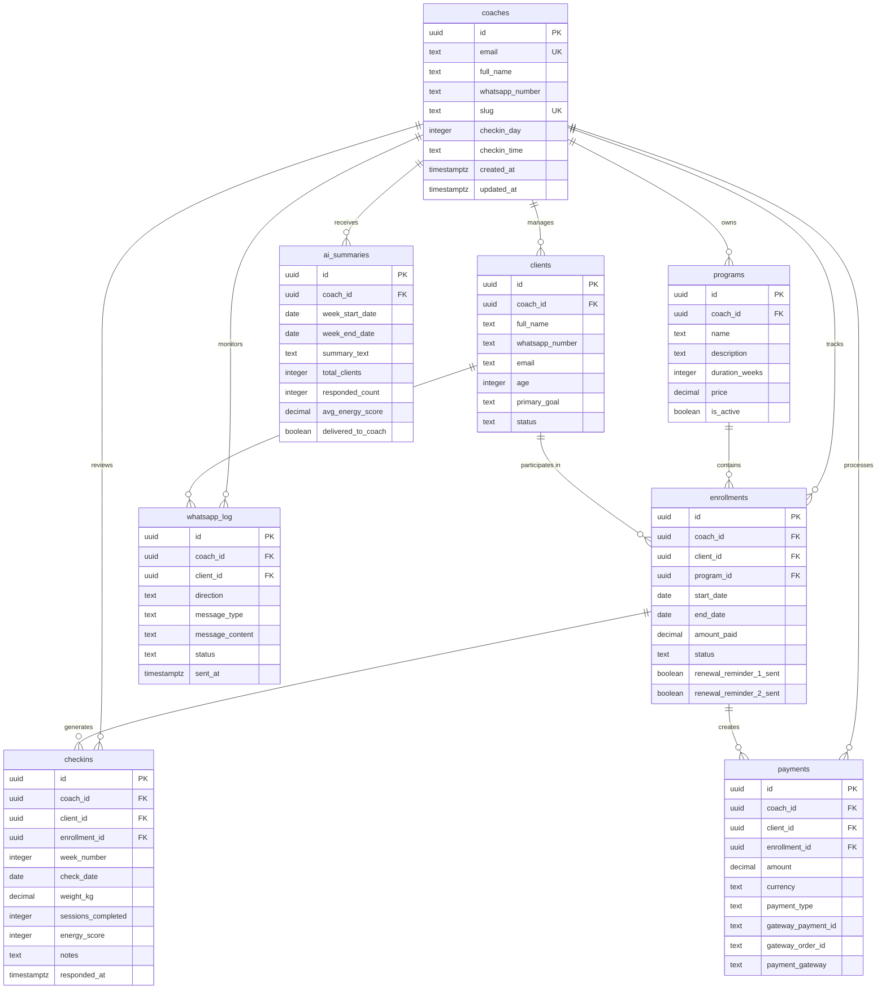
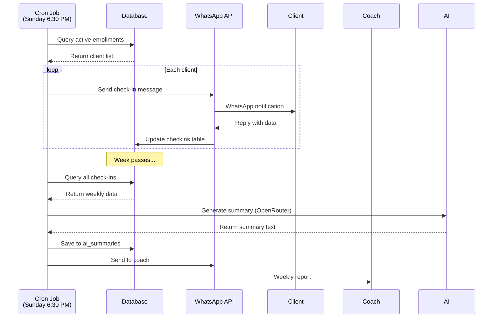
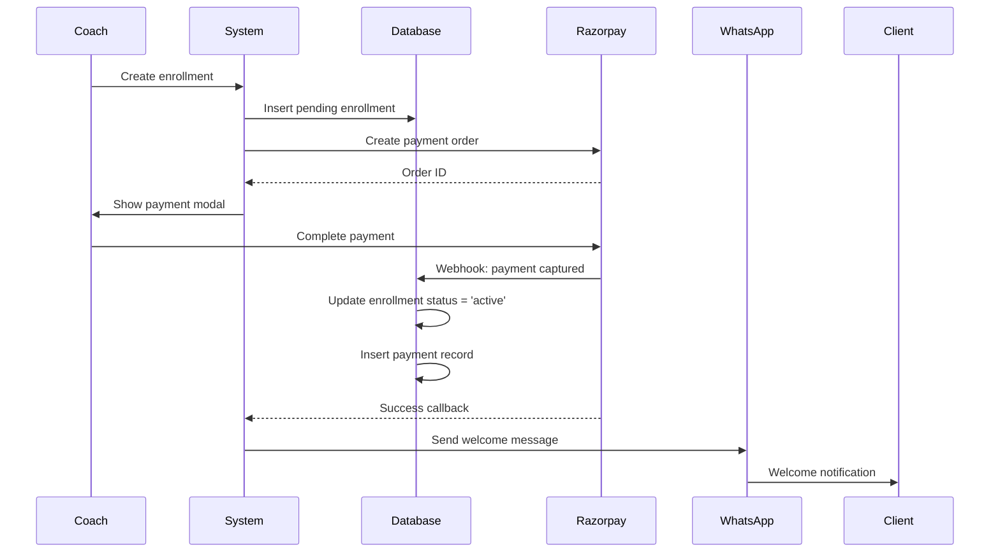
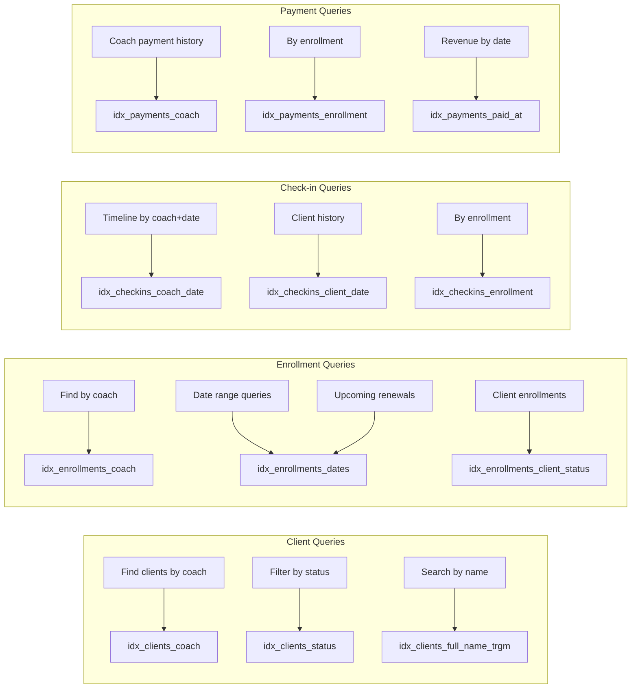
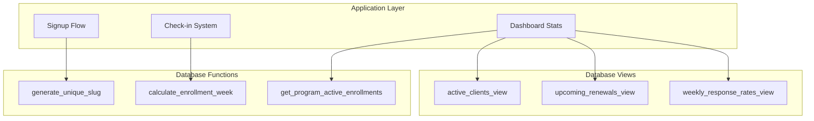
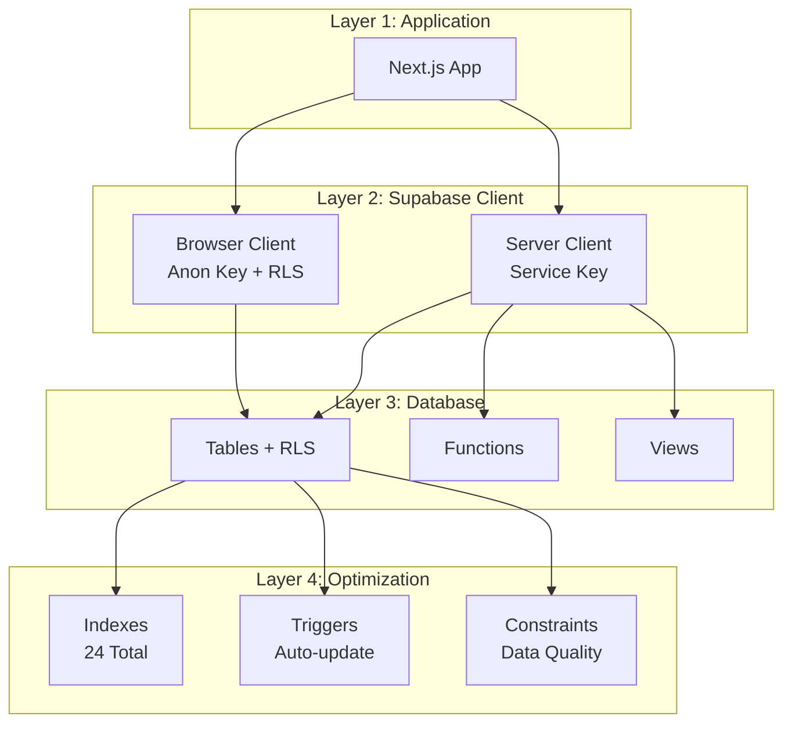
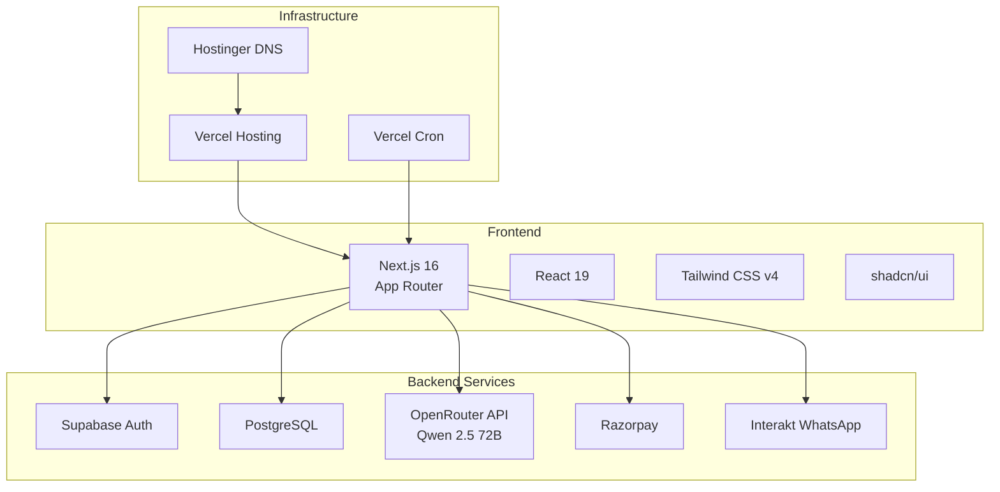

# Fitosys Database Architecture - Phase 1 Complete

## Entity Relationship Diagram



## Multi-Tenancy Architecture

```mermaid
graph TB
    subgraph "Authentication Layer"
        A[Supabase Auth] -->|auth.uid()| B[RLS Policies]
    end
    
    subgraph "Row Level Security"
        B -->|coach_id = auth.uid()| C[Programs]
        B -->|coach_id = auth.uid()| D[Clients]
        B -->|coach_id = auth.uid()| E[Enrollments]
        B -->|coach_id = auth.uid()| F[Checkins]
        B -->|coach_id = auth.uid| G[AI Summaries]
        B -->|coach_id = auth.uid()| H[Payments]
        B -->|coach_id = auth.uid()| I[WhatsApp Log]
    end
    
    subgraph "Service Role Bypass"
        J[Cron Jobs] -->|Service Key| K[Bypasses RLS]
        L[Webhooks] -->|Service Key| K
        M[Admin Tasks] -->|Service Key| K
    end
    
    style A fill:#E8001D,color:#fff
    style B fill:#E8001D,color:#fff
    style J fill:#0A0A0A,color:#fff
    style L fill:#0A0A0A,color:#fff
    style M fill:#0A0A0A,color:#fff
```

## Data Flow Architecture

### Weekly Check-In Cycle



### Enrollment & Payment Flow



## Index Strategy

### Query Patterns & Supporting Indexes



## RLS Policy Matrix

```
┌─────────────┬──────────┬─────────┬─────────┬──────────┐
│ Table       │ SELECT   │ INSERT  │ UPDATE  │ DELETE   │
├─────────────┼──────────┼─────────┼─────────┼──────────┤
│ coaches     │ ✅ Own   │ ❌      │ ✅ Own  │ ❌       │
│ programs    │ ✅ Own   │ ✅ Own  │ ✅ Own  │ ✅ Own   │
│ clients     │ ✅ Own   │ ✅ Own  │ ✅ Own  │ ✅ Own   │
│ enrollments │ ✅ Own   │ ✅ Own  │ ✅ Own  │ ✅ Own   │
│ checkins    │ ✅ Own   │ ✅ Own  │ ✅ Own  │ ✅ Own   │
│ ai_summaries│ ✅ Own   │ ✅ Own  │ ✅ Own  │ ✅ Own   │
│ payments    │ ✅ Own   │ ✅ Own  │ ✅ Own  │ ✅ Own   │
│ whatsapp_log│ ✅ Own   │ ✅ Own  │ ❌      │ ❌       │
└─────────────┴──────────┴─────────┴─────────┴──────────┘

Legend: ✅ = Allowed | ❌ = Not Allowed | Own = coach_id = auth.uid()
```

## Function Dependencies



## Performance Optimization Layers



## Security Layers

```mermaid
graph TB
    subgraph "Layer 1: Authentication"
        A[Supabase Auth<br/>Email/Password]
    end
    
    subgraph "Layer 2: Authorization"
        B[RLS Policies<br/>coach_id = auth.uid()]
    end
    
    subgraph "Layer 3: Network"
        C[API Routes<br/>CRON_SECRET]
        D[Webhooks<br/>Signature Verification]
    end
    
    subgraph "Layer 4: Data"
        E[Constraints<br/>Validation]
        F[Cascade Deletes<br/>Referential Integrity]
    end
    
    A --> B
    B --> C
    B --> D
    C --> E
    D --> F
```

## Migration Version History

```
┌─────────────────────────────────────────────────────────┐
│ Migration 001: Initial Schema                           │
│ - 8 Tables Created                                      │
│ - Basic RLS (SELECT only)                               │
│ - 7 Basic Indexes                                       │
└─────────────────────────────────────────────────────────┘
                         ↓
┌─────────────────────────────────────────────────────────┐
│ Migration 002: Razorpay Integration                     │
│ - Gateway-agnostic columns                              │
│ - Pending enrollment support                            │
│ - Payment workflow updates                              │
└─────────────────────────────────────────────────────────┘
                         ↓
┌─────────────────────────────────────────────────────────┐
│ Migration 003: Phase 1 Completion                       │
│ - Complete RLS (24 policies, full CRUD)                 │
│ - Auto-update triggers                                  │
│ - 3 Database functions                                  │
│ - 3 Analytical views                                    │
│ - 17 Additional indexes                                 │
│ - Cascade delete fixes                                  │
│ - Data validation constraints                           │
│ - Comprehensive documentation                           │
└─────────────────────────────────────────────────────────┘
```

## Technology Stack Integration



---

**Document Version:** 1.0  
**Last Updated:** March 7, 2026  
**Phase:** 1 Complete ✅
